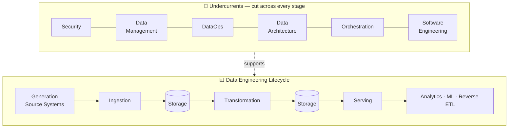
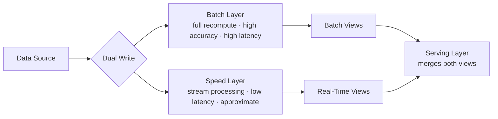
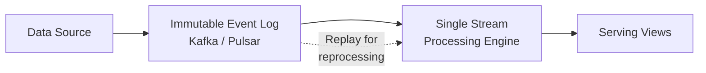
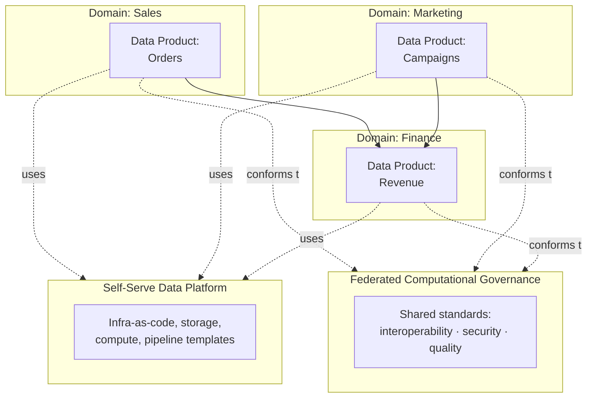
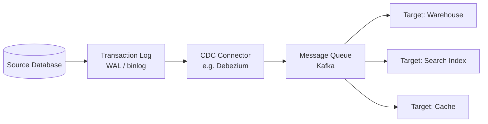
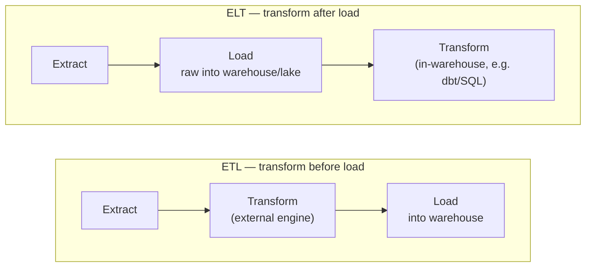
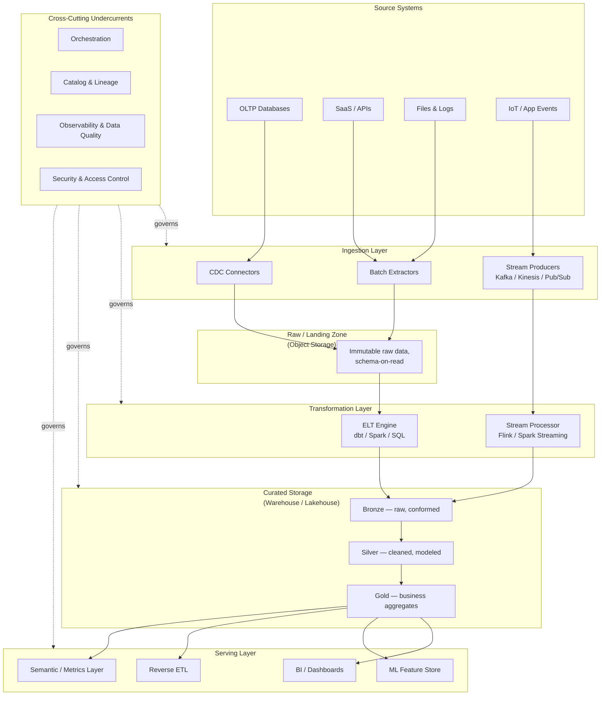

# Senior Data Engineer's Architecture Guide

### Grounded in *Fundamentals of Data Engineering* (Reis & Housley, O'Reilly 2022)

**Purpose:** One self-sufficient document to recall every major data pipeline
architecture concept for interviews and real-world design work.

**Legend used throughout this doc:**

- 📘 **Book** — concept, framework, or terminology drawn from *Fundamentals of
Data Engineering*, paraphrased in my own words (never copied verbatim).
- 🌐 **Industry context** — widely-used real-world practice added for
completeness (e.g., naming conventions, specific tools) that goes beyond
what the book states explicitly. Flagged so you always know the source.

---

## Table of Contents

1. [The Core Framework: The Data Engineering Lifecycle](#1-the-core-framework-the-data-engineering-lifecycle)
2. [Principles of Good Data Architecture](#2-principles-of-good-data-architecture)
3. [Architecture Patterns Catalog](#3-architecture-patterns-catalog)
4. [Choosing Technologies: The Decision Framework](#4-choosing-technologies-the-decision-framework)
5. [Lifecycle Stage Deep Dives](#5-lifecycle-stage-deep-dives)
6. [The Undercurrents (Cross-Cutting Disciplines)](#6-the-undercurrents-cross-cutting-disciplines)
7. [Security & Privacy](#7-security--privacy)
8. [Putting It All Together: A Reference Pipeline Architecture](#8-putting-it-all-together-a-reference-pipeline-architecture)
9. [Trade-off Cheat Sheets](#9-trade-off-cheat-sheets)
10. [Interview Question Map](#10-interview-question-map)
11. [Glossary](#11-glossary)

---

## 1. The Core Framework: The Data Engineering Lifecycle

📘 **Book** (Ch.2). Everything in data engineering maps onto five stages.
Storage isn't a single step — it recurs *between* every other stage, which is
why the book draws it as an underlying layer rather than a single box in a
straight line.

| Stage              | What happens                                                                  | Typical concerns                                                 |
| ------------------ | ----------------------------------------------------------------------------- | ---------------------------------------------------------------- |
| **Generation**     | Data is produced by source systems (apps, sensors, SaaS tools, third parties) | You don't control the source's schema, uptime, or change cadence |
| **Storage**        | Data is persisted, often repeatedly, between every other stage                | Access patterns, cost, durability, scalability                   |
| **Ingestion**      | Data is moved from source systems into your storage                           | Batch vs. streaming, reliability, schema drift                   |
| **Transformation** | Raw data is turned into something usable                                      | Business logic, data modeling, quality                           |
| **Serving**        | Data reaches its consumers                                                    | **Analytics, ML, reverse ETL, "who trusts this number?"**        |

**Interview framing:** if asked "walk me through a pipeline you built," structure
your answer around these five stages — it signals you think in the same
framework interviewers trained on this book expect.

---

## 2. Principles of Good Data Architecture

📘 **Book** (Ch.3). Nine principles the book uses to judge whether an
architecture is "good," independent of any specific technology:

1. **Choose common components wisely** — shared tools/platforms reduce
  duplicated effort, but shouldn't be forced where they don't fit.
2. **Plan for failure** — assume disks, nodes, and services will fail; design
  for graceful degradation, not just the happy path.
3. **Architect for scalability** — scale up and back down; avoid over- or
  under-provisioning.
4. **Architecture is leadership** — architects mentor and set technical
  direction, they don't just draw diagrams.
5. **Always be architecting** — architecture is a continuous, iterative
  practice, not a one-time deliverable.
6. **Build loosely coupled systems** — components should be swappable
  without cascading rewrites elsewhere.
7. **Make reversible decisions** — given how fast the technology landscape
  moves, prefer decisions you can undo cheaply over "permanent" ones.
8. **Prioritize security** — security is everyone's job, applied at every
  layer (zero-trust mindset), not bolted on at the end.
9. **Embrace FinOps** — treat cloud cost as a continuous, cross-team
  engineering concern, not a monthly finance surprise.

**Interview framing:** these principles are a strong answer to "how do you
evaluate whether a proposed architecture is good?" — cite 3–4 of them with a
concrete example each.

---

## 3. Architecture Patterns Catalog

📘 **Book** (Ch.3) surveys these patterns; 🌐 industry notes added where useful.

### 3.1 Data Warehouse

Centralized, structured, query-optimized storage for analytical workloads —
historically on-prem (Teradata) or cloud (Snowflake, BigQuery, Redshift).
Optimized for SQL analytics on structured/semi-structured data.

### 3.2 Data Lake

Cheap, scalable object storage (originally on Hadoop/HDFS, now S3/GCS/ADLS)
that stores raw data in any format with schema-on-read. Flexible, but easy to
turn into a "data swamp" without governance.

### 3.3 Data Lakehouse

📘 The convergence pattern: lake-style cheap object storage plus
warehouse-style transactional guarantees (via table formats like Delta Lake,
Iceberg, Hudi 🌐), enabling both BI and ML on one copy of data.

### 3.4 Modern Data Stack

🌐/📘 A cloud-based, modular, mostly-managed/SaaS toolchain — ingestion tool
(Fivetran/Airbyte) → cloud warehouse → transformation (dbt) → BI tool
(Looker/Tableau) — replacing hand-rolled on-prem stacks.

### 3.5 Lambda Architecture

📘 Runs **two parallel pipelines** on the same source: a batch layer (full
recompute, high accuracy, high latency) and a speed layer (stream processing,
low latency, approximate), merged at serving time.

**Trade-off:** accuracy + freshness, at the cost of maintaining and
reconciling two separate codebases doing similar logic.

### 3.6 Kappa Architecture

📘 Simplifies Lambda: **one streaming pipeline** only. Batch is treated as a
special case of streaming (replaying the log), so there's a single codebase.

**Trade-off:** one codebase to maintain, but requires everything — including
historical backfills — to work as a stream, which isn't always natural.

### 3.7 The Dataflow Model / Unified Batch & Streaming

📘 Treats batch as a bounded special case of streaming (the idea behind
Apache Beam), letting one API express both — reduces the Lambda-style
duplication without forcing a pure-streaming worldview like Kappa.

### 3.8 Data Mesh

📘 Decentralizes data ownership to **domain teams**, who publish
**data products**, on top of a **self-serve platform**, governed by
**federated computational governance** (shared standards, not central
control).

**Trade-off:** scales ownership across a large org, at the cost of needing
real platform investment and governance discipline — often a poor fit for
small teams.

### 3.9 Event-Driven Architecture

📘 Systems communicate via events (state changes) rather than direct
calls/polling — enables loose coupling and near-real-time reactions, at the
cost of eventual-consistency reasoning and harder debugging (no single
call stack to trace).

### 3.10 IoT-Oriented Architecture

📘 High-volume, high-velocity device data — typically ingested through
lightweight protocols (MQTT 🌐) into a message/streaming layer before
landing in storage; edge processing is often used to pre-filter/aggregate
before transmission.

### 3.11 Tight vs. Loose Coupling — Monoliths, Tiers, Microservices

📘 A monolith bundles everything into one deployable unit (simple to start,
hard to scale a team around); microservices split responsibility into
independently deployable services (flexible, but adds network/ops
complexity). The book also flags the **distributed monolith** anti-pattern:
services that are physically separate but so tightly coupled they must be
deployed together — the worst of both worlds.

### 3.12 🌐 Medallion Architecture (Bronze / Silver / Gold)

Not book terminology verbatim, but the standard real-world implementation
pattern for lakehouse transformation layers — worth knowing cold for
interviews:

- **Bronze** — raw data, as ingested, immutable.
- **Silver** — cleaned, deduplicated, conformed to a schema.
- **Gold** — business-level aggregates ready for BI/ML consumption.

---

## 4. Choosing Technologies: The Decision Framework

📘 **Book** (Ch.4). The book deliberately separates *architecture* (the
blueprint) from *technology* (the specific tools) — a common interview
distinction. Decision factors:

- **Team size & capabilities** — don't pick something your team can't operate.
- **Speed to market** — ship something usable now vs. the "perfect" system later.
- **Interoperability** — how well does it play with the rest of your stack?
- **Cost** — **TCO** (Total Cost of Ownership: infra + people + time) vs.
**TOCO** (Total Opportunity Cost of Ownership: what you *can't* do because
you chose this) — and **FinOps** as the ongoing discipline of managing
cloud spend collaboratively across engineering and finance.
- **Immutable vs. transitory technology** — some things (object storage,
SQL) are durable bets; others (this month's trendy framework) churn fast.
- **Location** — on-premises vs. cloud vs. hybrid vs. multicloud vs.
decentralized (edge/blockchain).
- **Build vs. buy** — open source and self-managed vs. proprietary managed
services; there's no universally right answer, only the right trade-off
for your constraints.
- **Monolith vs. modular** — same trade-off as architecture, applied to
tool choice.
- **Serverless vs. servers** — pay-per-use, zero ops (serverless) vs.
control and predictable cost at scale (provisioned infrastructure).
- **Benchmarks are marketing** — the book is explicit that vendor
benchmarks are frequently cherry-picked; validate on your own workload.

---

## 5. Lifecycle Stage Deep Dives

### 5.1 Generation — Source Systems

📘 **Book** (Ch.5).

- **OLTP** (transactional databases: Postgres, MySQL) — optimized for
fast, small read/writes; **OLAP** — optimized for large analytical scans.
- **Change Data Capture (CDC)** — capturing row-level changes from a
database's transaction log instead of re-querying the whole table.
- **Logs** — application/event logs as a data source.
- **Messages & streams** — event-based systems (Kafka, Kinesis, Pub/Sub).
- **CRUD vs. insert-only** patterns affect how you can safely re-read source data.
- You rarely control the source schema — expect drift and design for it.

### 5.2 Storage

📘 **Book** (Ch.6).

- **Raw ingredients:** magnetic disk, SSD, RAM, networking — each with a
different latency/throughput/cost profile that ripples up into every
storage system built on top.
- **Storage system types:** file storage, block storage, object storage
(the backbone of modern lakes), cache/memory stores, HDFS, streaming
storage (the log itself as a store).
- **Consistency:** eventual vs. strong consistency trade-offs, and
single-machine vs. distributed storage.
- **Abstractions built on top:** warehouse, lake, lakehouse, data platform.
- **Trends:** separating compute from storage (scale each independently —
the core enabler of the modern cloud warehouse), data retention policy
and lifecycle management, single- vs. multi-tenant storage, and treating
the **data catalog** as core infrastructure, not an afterthought.

### 5.3 Ingestion

📘 **Book** (Ch.7).

- **Batch vs. streaming** is the central trade-off — batch is simpler and
cheaper; streaming reduces latency but adds operational complexity.
- **Push vs. pull vs. poll** — does the source push data to you, do you pull
on demand, or do you poll on an interval?
- **Key engineering considerations:** frequency, throughput/scalability,
reliability & durability, payload size/shape, synchronous vs. async.
- **Streaming-specific concerns:** schema evolution, late-arriving data,
ordering & at-least/exactly-once delivery, replay, time-to-live, dead-letter
queues for poison messages.
- **Concrete methods:** direct DB connection, CDC, APIs, message
queues/event streaming, managed connectors (Fivetran-style), object
storage transfer, webhooks, EDI, even physical transfer appliances for
very large migrations.

**ETL vs. ELT** (core ingestion→transformation trade-off):

ELT became dominant once cloud warehouses made compute cheap and elastic —
you no longer need a separate transform engine before loading.

### 5.4 Queries, Modeling & Transformation

📘 **Book** (Ch.8).

- **Query lifecycle:** parse → optimize → execute; understanding the query
optimizer helps you write performant SQL and design better schemas.
- **Data modeling levels:** conceptual (business concepts) → logical
(entities/relationships, tech-agnostic) → physical (actual tables/columns
for a specific engine).
- **Normalization:** organizing tables (1NF/2NF/3NF-style thinking) to
reduce redundancy — a normalized/Inmon-style model is common upstream.
- **Batch analytical modeling techniques the book surveys** include
dimensional/star-schema modeling (Kimball-style fact & dimension tables),
Data Vault (hub/link/satellite, built for auditability and change
tracking), and wide/denormalized "one big table" approaches favored for
simplicity at query time.
- **Streaming data modeling** is harder — schemas evolve while data is
in motion, and there's no single "final" state to model against.
- **Transformation patterns:** batch transformations, materialized views /
query federation / query virtualization (querying across sources without
copying data), and streaming transformations/processing.

### 5.5 Serving

📘 **Book** (Ch.9).

- **Trust first** — the book stresses that serving isn't just "make data
available," it's making data *trustworthy* enough that consumers act on it.
- **Know your consumer and use case:** business analytics, operational
analytics (feeding live business processes), embedded analytics
(analytics inside a product).
- **What a data engineer should know about ML:** feature quality and
freshness matter more than algorithm choice for most real-world problems.
- **Serving mechanisms:** file exchange, databases, streaming systems,
query federation, data sharing, **semantic/metrics layers** (a single
place metric definitions live so "revenue" means the same thing
everywhere), and serving directly into notebooks.
- **Reverse ETL** — pushing warehouse data *back* into operational SaaS
tools (e.g., CRM), closing the loop between analytics and action.

---

## 6. The Undercurrents (Cross-Cutting Disciplines)

📘 **Book** (Ch.2, revisited in every stage chapter). These aren't stages —
they're disciplines that apply to *every* stage simultaneously:

| Undercurrent             | What it means in practice                                                |
| ------------------------ | ------------------------------------------------------------------------ |
| **Security**             | Least privilege, encryption, access control at every layer               |
| **Data Management**      | Governance, data quality, master data, metadata, ethics/privacy          |
| **DataOps**              | Applying DevOps practices (CI/CD, testing, monitoring) to data pipelines |
| **Data Architecture**    | The ongoing discipline of Section 2, applied continuously                |
| **Orchestration**        | Coordinating dependencies between jobs across the whole lifecycle        |
| **Software Engineering** | Version control, testing, code review — pipelines are software           |

**Interview framing:** when asked "what would you add to this pipeline
design," the undercurrents are your checklist — orchestration, testing,
monitoring, security, governance, cost.

---

## 7. Security & Privacy

📘 **Book** (Ch.10). Organized around three pillars:

- **People** — security is a *culture and habit* problem first; social
engineering is often the weakest link, not the technology.
- **Process** — formal security policy, documented and practiced (e.g. an
incident response plan you've actually rehearsed).
- **Technology** — patch/update cadence, encryption at rest and in transit,
logging/monitoring/alerting, and tightly scoped network access.

Privacy adds legal weight on top of good security practice (GDPR/CCPA-style
obligations 🌐) — minimize personal data collected, and know where it flows.

---

## 8. Putting It All Together: A Reference Pipeline Architecture

🌐 **Synthesis** — this diagram isn't reproduced from the book; it's my own
composite of the lifecycle stages and patterns above into the kind of
end-to-end architecture a senior data engineer should be able to sketch on a
whiteboard from memory.

**How to narrate this in an interview:** left to right — sources vary in
shape and speed, so ingestion branches into batch/CDC/streaming; everything
lands raw first (never transform on the way in — preserve the source of
truth); transformation happens in layers (bronze→silver→gold) so you can
always trace a number back to its raw origin; serving fans out to whatever
consumer needs it; and orchestration/catalog/observability/security wrap the
whole thing rather than living in any one box.

---

## 9. Trade-off Cheat Sheets

### Lambda vs. Kappa

|            | Lambda                                                                | Kappa                                                         |
| ---------- | --------------------------------------------------------------------- | ------------------------------------------------------------- |
| Codebases  | Two (batch + stream)                                                  | One (stream only)                                             |
| Accuracy   | High (batch recompute)                                                | Depends on stream logic                                       |
| Complexity | Higher (reconcile two systems)                                        | Lower, but everything must fit the streaming model            |
| Best for   | Mixed workloads needing both perfect batch and fast approximate views | Teams standardized on streaming infra (e.g. Kafka everywhere) |

### Warehouse vs. Lake vs. Lakehouse

|             | Warehouse                | Lake                            | Lakehouse                      |
| ----------- | ------------------------ | ------------------------------- | ------------------------------ |
| Data shape  | Structured               | Any (raw)                       | Any, with structure layered on |
| Schema      | Schema-on-write          | Schema-on-read                  | Both, via table format         |
| Primary use | BI/SQL analytics         | ML, exploration, archival       | Unified BI + ML                |
| Risk        | Rigid, costly to reshape | "Data swamp" without governance | Newer tooling, still maturing  |

### ETL vs. ELT

|                    | ETL                                    | ELT                                                |
| ------------------ | -------------------------------------- | -------------------------------------------------- |
| Transform location | External engine, before load           | In-warehouse, after load                           |
| When it dominated  | On-prem era, limited warehouse compute | Cloud era, cheap elastic compute                   |
| Flexibility        | Lower (re-extract to change transform) | Higher (raw data always available to re-transform) |

### Push vs. Pull vs. Poll (ingestion)

|               | Push                            | Pull                            | Poll                                            |
| ------------- | ------------------------------- | ------------------------------- | ----------------------------------------------- |
| Who initiates | Source sends data               | Consumer requests on demand     | Consumer checks on an interval                  |
| Latency       | Low                             | Depends                         | Bound by interval                               |
| Coupling      | Source must know about consumer | Consumer must know source's API | Loosest, but wastes cycles checking for nothing |

### Batch vs. Streaming

|                 | Batch                          | Streaming                                              |
| --------------- | ------------------------------ | ------------------------------------------------------ |
| Latency         | Minutes–hours (or more)        | Seconds or less                                        |
| Complexity/cost | Lower                          | Higher (state, ordering, backpressure)                 |
| Good fit        | Reporting, historical analysis | Fraud detection, real-time personalization, monitoring |

### Build vs. Buy

|            | Build (self-managed/OSS)              | Buy (managed/proprietary)   |
| ---------- | ------------------------------------- | --------------------------- |
| Control    | Full                                  | Limited to vendor's roadmap |
| Ops burden | High (you run it)                     | Low (vendor runs it)        |
| Cost shape | CapEx-like, engineering time          | OpEx, usage-based           |
| Best fit   | Core differentiator for your business | Commodity capability        |

### Monolith vs. Microservices (architecture)

|                   | Monolith                   | Microservices                                                                |
| ----------------- | -------------------------- | ---------------------------------------------------------------------------- |
| Simplicity        | Higher initially           | Lower initially                                                              |
| Team scaling      | Harder past a certain size | Easier — independent deploys                                                 |
| Failure isolation | Weaker                     | Stronger (if done right)                                                     |
| Anti-pattern risk | —                          | **Distributed monolith**: services split but still deployed/coupled together |

---

## 10. Interview Question Map

Use this to rehearse — each question maps to a section above.

- *"Design a data pipeline for X."* → §8 (reference architecture) + §5 (stage details)
- *"Lambda vs. Kappa — which would you pick and why?"* → §3.5–3.6, §9
- *"How do you decide between a data lake and a warehouse?"* → §3.1–3.3, §9
- *"What's the difference between ETL and ELT, and why did the industry shift?"* → §5.3, §9
- *"How would you handle schema drift from an upstream source?"* → §5.1, §5.3
- *"What is CDC, and when would you use it over batch extraction?"* → §5.1, §5.3
- *"How do you evaluate whether an architecture is 'good'?"* → §2
- *"What's data mesh, and when is it a bad idea?"* → §3.8
- *"How do you approach data modeling for a new analytical dataset?"* → §5.4
- *"What does 'undercurrents' mean and why do they matter?"* → §6
- *"Build vs. buy for a new ingestion tool — how do you decide?"* → §4, §9
- *"How do you make sure downstream consumers trust your data?"* → §5.5, §6 (Data Management)
- *"Walk me through your approach to pipeline security."* → §7

---

## 11. Glossary

- **CDC (Change Data Capture)** — capturing row-level changes from a
database's transaction log rather than re-querying full tables.
- **Data Product** — in data mesh, a domain-owned, discoverable, trustworthy
dataset treated like a product with an owner and SLAs.
- **Data Vault** — a modeling methodology (hubs/links/satellites) built for
auditability and handling change over time.
- **DataOps** — applying DevOps discipline (CI/CD, testing, monitoring,
incident response) to data pipelines.
- **ELT** — Extract, **Load**, Transform: raw data lands first, transform
happens inside the target system.
- **ETL** — Extract, **Transform**, Load: transform happens before loading.
- **FinOps** — the ongoing, cross-team practice of managing and optimizing
cloud cost.
- **Kappa Architecture** — single-streaming-pipeline design; batch is a
replay of the log.
- **Lakehouse** — object storage plus a transactional table format,
combining lake flexibility with warehouse guarantees.
- **Lambda Architecture** — parallel batch + speed layers reconciled at
serving time.
- **OLAP** — Online Analytical Processing; optimized for large scan/
aggregate queries.
- **OLTP** — Online Transaction Processing; optimized for small, fast
read/write operations.
- **Reverse ETL** — moving data from the warehouse back into operational
SaaS tools.
- **Schema-on-read vs. schema-on-write** — whether structure is enforced at
write time (warehouse) or interpreted at read time (lake).
- **Semantic/Metrics Layer** — a single source of truth for how a business
metric is defined and calculated across tools.
- **Star Schema** — a dimensional modeling pattern with a central fact table
joined to surrounding dimension tables.
- **TCO / TOCO** — Total Cost of Ownership vs. Total Opportunity Cost of
Ownership — what a choice costs vs. what it forecloses.
- **Undercurrents** — the six cross-cutting disciplines (security, data
management, DataOps, data architecture, orchestration, software
engineering) that apply across every lifecycle stage.

---

*Source: Fundamentals of Data Engineering by Joe Reis and Matt Housley
(O'Reilly, 2022). Book-sourced sections are paraphrased summaries of the
book's frameworks and terminology, not reproductions of its text. See the
companion* `.mermaid` *files for standalone renderable versions of the four
flagship diagrams.*